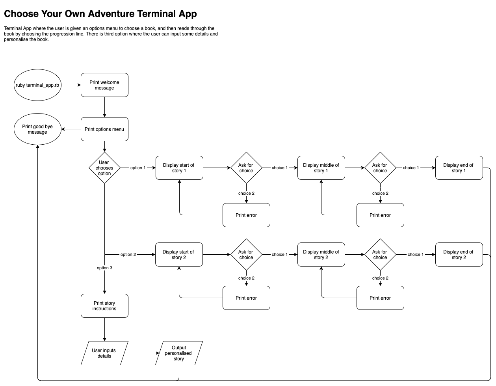
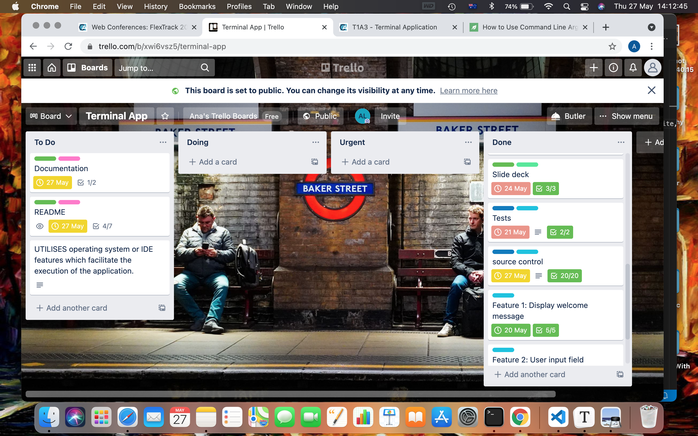
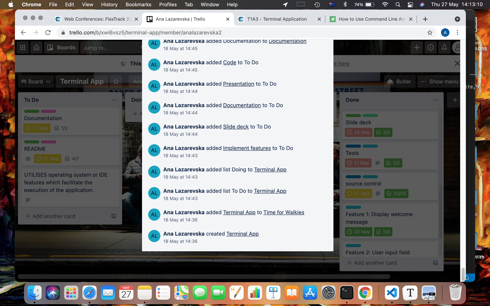
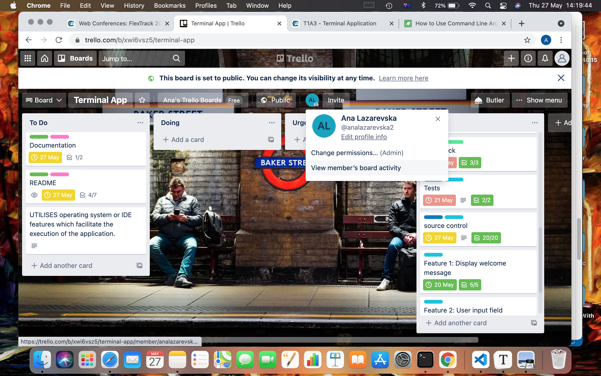

# Choose Your Own Adventure Terminal App

A simple app for the Terminal that is written in Ruby and is inspired by the Choose-your-own-adventure books. 

# Link to GitHub repository

https://github.com/aplazarevska/terminal-app

# Software Development Plan

I developed the Choose Your Own Adventure Terminal App as part of the Coder Academy assessment requirements. It is a simple application for Terminal, written in Ruby, and inspired by the Choose Your Own Adventure books. 

The application is made as a tool of entertainment. I wanted to create an application of several layers of nested loops, one that is like a maze of code that translates into a story maze. I also wanted to include a bit of variety, an option for the user to personalise the story if they wish so. So basically, what the application will do is to set the user on a reading adventure where the path of progression will depend on the user’s answers. Due to the time constraint, and the fact that I am not really a writer but a coder, for now the application takes the user back to the choices menu if they give a wrong answer. So there are two stories presented in the application for now, and each has three parts. Moving from one part to the next is done by answering a question related to the story. A wrong answer simply gives an error message. In the case with the error messages, I wanted to use coding errors that somehow fit the wrong answer. If this sounds confusing, you just need to use the app and all will become more clear. 

I am hoping that this app can appeal to adults from all age groups and fields of life. But the two stories that I present in the app for now are targeting the coder audience. The audience will use the app by following the instructions that are implemented throughout it. The progression line is simple, and there are four points of exit (one point of exit when the user will finish reading a story, and one point of exit from the main options menu.)

# List of Features

The Terminal App is built around a nested loop, so the loop is the main feature of the app. The code of the main structure is written in the main file of the app, the terminal_app.rb file. Each story is delivered in a loop that has two small loops inside. The loop is comprised of conditional statements. For conditional statements that correspond to wrong answers the loop takes the user back to the previous choices menu. For conditional statement that correspond to right answer the smaller, nested loop is broken, but the main loop continues until the user is done reading the three parts of the story. 

Variables are used extensively in the app. I use instance variables so that the app can use them from other file by pointing to the relative path leading to the file that contains them. The main file terminal_app.rb has local variables because they are only used form that file. They mostly correspond to the welcome messages and the options in the menus. Most of the variables used in the app are meant to be kept constant, in the same form in which they are defined. That is except in the option when the user can change the story by providing personal inputs. 

In the user input part of the app I included error handling. The basic reason for that is because I use the TTY Prompt Gem which allows for browsing through options menu, so the user does not need to input the option, which removes the possibilities of errors. In the case when the user is required to input a value for personalising the story, in order for the story to be logical, I included error handling to check if the user inputs a number or an empty value. In that case the TypeError is raised, and the user is required to retry inputing the correct value. 

# UX/UI Outline

The application is very easy to use. The pathway is linear, and every time the user needs to make a choice, that choice is explained with a short message. Scrolling through the options/choices menu is also clearly explained. 

The first thing the user sees when starting the app is the welcome message. A Gem is implemented to make the first words larger, to resemble a title of a book. The welcome messages are also displayed one character at a time, to capture the attention of the reader and direct their focus to the possible topic of the app - which is a book, a written book. The menu options are presented with a Gem, for easier browsing, and the user only needs to use the arrow and enter keys to make a choice. 

Colours are used throughout the app for various purposes: the main text of each book is in blue, the instruction messages, and important comments are in red. I did not want to overwhelm the app with colours and effects, so the user can concentrate on the story instead of on the look of the app. On the last page, the inspiration for each story, i.e. the reference is highlighted on a blue background, to be easily distinguished from the rest of the text.

There is no option for errors, as the user input is included in the story in whatever form it will be given, and the rest of the app has straightforward logic. But to make the personalised story more meaningful, to have letters (hopefully words of meaning), I included error handling in case the user inputs a number or an empty space. 

# Control Flow Diagram

# Implementation Plan

Access the Trello Board for the Terminal App: https://trello.com/b/xwi6vsz5

**SCREENSHOTS**

For more detailed activity use the View member's board activity option in Trello.

# Help Documentation

To run the Terminal App the user will need to have Ruby installed on his computer. To check if they have it installed they can run `ruby -v` in their Command Line. The official Ruby docs include vast information on installing Ruby on all kinds of systems (https://www.ruby-lang.org/en/documentation/installation/). 

There are several ways to run this Terminal App. The user can request to pull the code from the GitHub repository (link is provided at the top of this document). It can be run on Terminal by going to the file's directory and typing `ruby terminal_app.rb` or by running the script from the same directory by typing `./run_app.sh`. To run the script the computer will use the Ruby interpreter. 

There are four Gems included in the App, all of which are found in the src directory. To run the tests included in the code the user needs to type `rspec` in the root directory of the app. 

The application is tested to run on Mac OS Big Sur, using Ruby programming language version 3.0.1. 